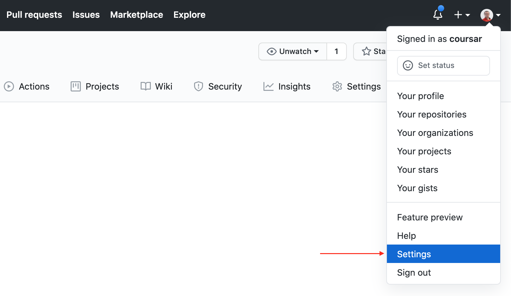
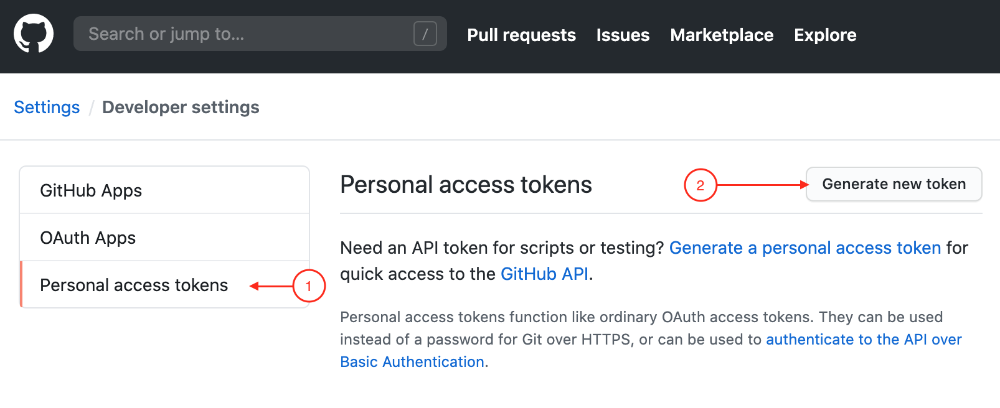
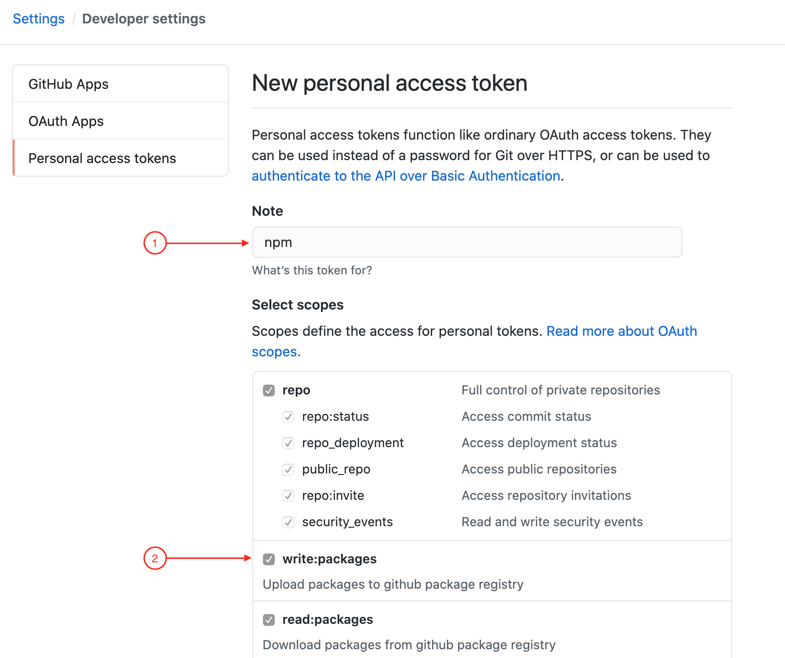
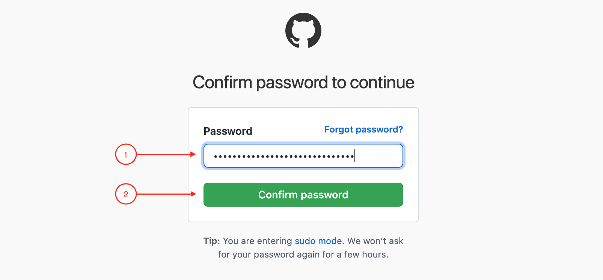
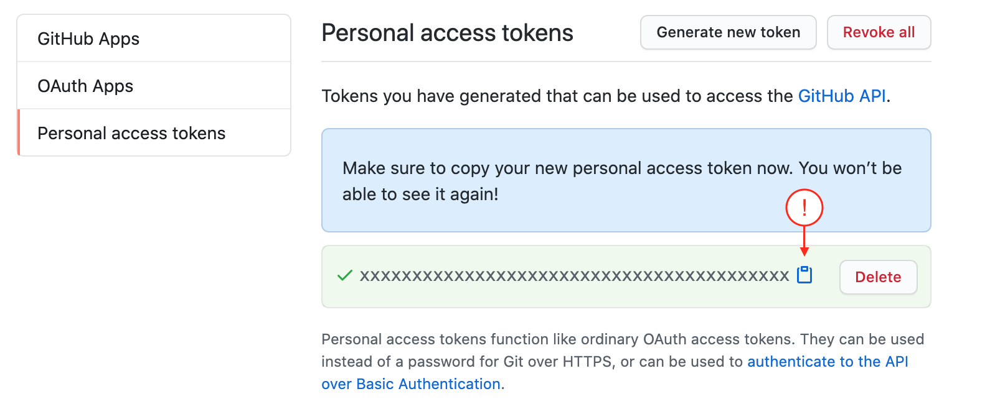
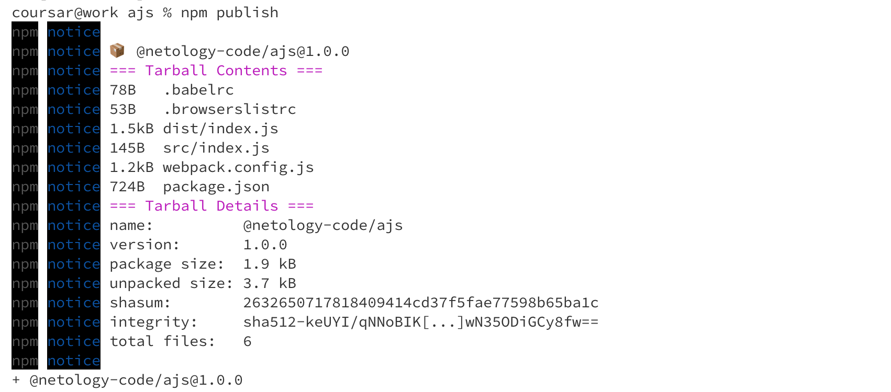
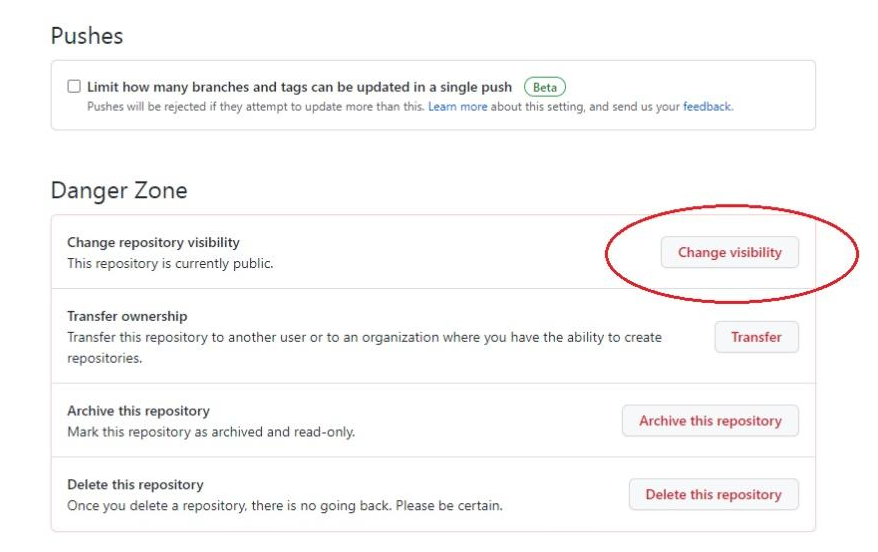
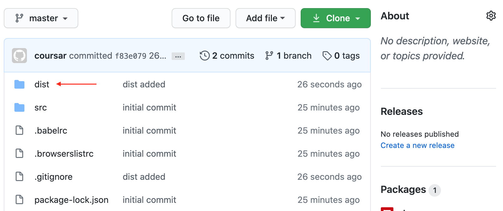
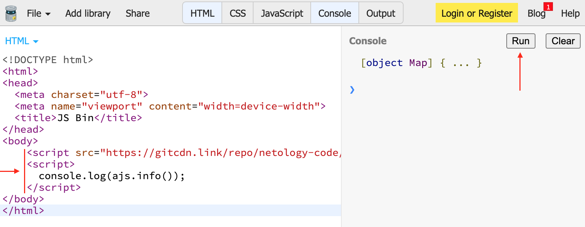
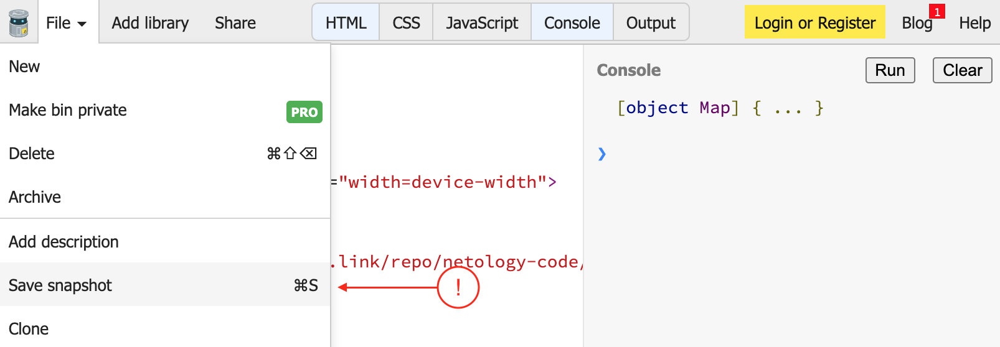

# Домашнее задание к лекции «Платформы: браузер vs Node.js»

## Библиотека для браузера и Node.js

### Легенда

Вы решили создать библиотеку, которую можно будет использовать как в браузере, так и в Node.js. Если вы помните, то мы рассматривали Moment.js, в котором бы хитрый код.

Давайте попробуем создать библиотеку, в которой будет такой же код, но генерироваться он, естественно, будет автоматически.

Для этого мы воспользуемся [возможностями Webpack](https://webpack.js.org/guides/author-libraries/).

Цель этого задания следующая: научить вас публиковать пакеты и познакомить с тем, как публикуется большинство пакетов, с которыми мы будем работать в дальнейшем.

### Описание

#### Шаг 0. Создание репозитория

Перейдите на GitHub и создайте пустой репозиторий для вашего проекта (он нам понадобится для всех остальных действий). Мы будем подразумевать в рамках всей лабораторной работы, что вы назвали репозиторий `ajs`.

Склонируйте этот репозиторий на вашу локальную машину и все дальнейшие действия выполняйте в каталоге склонированного репо.

#### Шаг 1. Генерация проекта

**Важно**: везде далее под:
1. `USERNAME` будет пониматься имя вашего пользователя на GitHub в нижнем регистре (все буквы маленькие)
1. `REPO` будет пониматься название вашего репозитория на GitHub в нижнем регистре (все буквы маленькие)
1. `TOKEN` будет access token (см. ниже), который вы сгенерируете на GitHub

Создайте репозиторий на GitHub, после чего с помощью `npm init --scope=@username` (где `username` - имя вашего пользователя на GitHub в нижнем регистре, например, если на GitHub у меня логин `Netology-Code`, то команда будет `npm init --scope=@netology-code`) сгенерируйте package:
1. package name - @username/ajs (вам предложат автоматически)
1. version - 1.0.0 (по умолчанию)
1. description - оставьте пустым (по умолчанию)
1. entry point - dist/index.js (!надо поменять на dist/index.js)
1. остальное всё по умолчанию (просто нажимайте enter)

Убедитесь, что в `packages.json` автоматически прописался адрес вашего репозитория.

Добавьте `.gitignore`, который мы для вас [приготовили](../.gitignore).

Сделайте commit и push, убедитесь, что код попал в ваш репозиторий на GitHub

#### Шаг 2. Получение Access Token

Мы будем использовать сервис GitHub Packages (куда вы опубликуете свою библиотеку), чтобы не замусоривать npmjs.com.

Для этого, нам нужно получить Access Token.

Перейдите в настройки:



Выберите пункт меню Developer Settings:


Выберите пункт меню Personal Access Tokens (1), затем нажмите на кнопку Generate new token (2):



Заполните поле Note (1) и поставьте флажок напротив write:packages (2), остальные все флажки выставятся автоматически:



После чего нажмите на кнопку Generate в самом низу страницы:


GitHub запроси у вас пароль для подтверждения:



После чего вам будет сгенерирован токен. **Важно**: токен будет показан только один раз, поэтому убедитесь, что скопировали его:



Если вдруг вы всё-таки не скопировали его, то просто удалите старый и сгенерируйте новый.

#### Шаг 3. Установка зависимостей

Установите следующие dev-зависимости:

* @babel/cli
* @babel/core
* @babel/preset-env
* babel-loader
* webpack
* webpack-cli

Обратите внимание, для простоты мы не устанавливаем corejs, в случае Node.js он вообще не нужен, а в случае браузера будем считать, что это ответственность подключающего библиотеку.


#### Шаг 4. Создание .npmrc

Перейдите в ваш домашний каталог (узнать, где он находится, можно с помощью команды `echo $HOME` в Linux/Mac или `echo %USERPROFILE%` в Windows) и создайте там файл `.npmrc` (не забудьте про точку) следующего содержания:

```
//npm.pkg.github.com/:_authToken=TOKEN
registry=https://npm.pkg.github.com/USERNAME
```

<details>
  <summary>Примечание!</summary>
  
---

NPM для работы использует свои глобальные конфигурационные настройки, но эти настройки можно перезаписывать. Документация NPM различает несколько типов `npmrc` файлов:

* per-project config file (/path/to/my/project/.npmrc) - проектный или локальный `config` файл
* per-user config file (~/.npmrc) - `config` файл пользовательский. (userconfig)
* global config file ($PREFIX/etc/npmrc) - глобальный `config` (globalconfig)
* npm builtin config file (/path/to/npm/npmrc) - встроенный файл конфигурации NPM

Все файлы конфигурации npm представляют собой список параметров в формате ini (ключ=значение). Каждый из этих файлов загружается, и параметры конфигурации разрешаются в порядке приоритета. Например, параметр в файле userconfig переопределит параметр в файле globalconfig потому что приоритет выше.
Более подробно о npmrc можно почитать в [документации NPM](https://docs.npmjs.com/cli/v9/configuring-npm/npmrc).

В этом задании вы создаёте пользовательский .npmrc (userconfig) файл для конфигурации и загрузки собственного пакета, в котором переопределяете переменную `registry`. Именно в этой переменной прописан путь до реестра пакетов NPM. Так как теперь при запуске npm переменная registry в globalconfig будет перезаписана, вы будете получать статус 404 на загрузку некоторых пакетов при выполнении следующих ДЗ на курсе. Для разрешения этой проблемы можно либо воспользоваться консольной командой
 ```bash
 npm config set registry https://registry.npmjs.org/
 ```
либо просто опустошить userconfig (или удалить его - эффект одинаковый).

---
</details>

Обратите внимание, вместо `TOKEN` вы подставляете токен, вместо `USERNAME` - имя своего пользователя в нижнем регистре.

Q: что это нам даёт?

A: NPM будет использовать эти данные для аутентификации, а с помощью GitHub Packages (запись `registry`) вы создадите собственный мини-аналог npmjs.com.

Q: почему мы сразу не публикуем на NPM?

A: чтобы не замусоривать его + из соображений безопасности, вам даётся всего 72 часа, чтобы удалить потом пакет оттуда (при условии, что никто не успел им воспользоваться). А кроме того, если вы удалите пакет, то потом уже не сможете воспользоваться этим именем (например, создадите пакет `ajs` для тестов, удалите его, а затем снова решите создать такой же - не получится). В GitHub Packages же проблем с этим не будет - можно просто удалить репо, создать новый и пробовать заново.

#### Шаг 5. Конфигурационные файлы

.babelrc:

```
{
  "presets": [
    [
      "@babel/preset-env"
    ]
  ]
}
```

.browserslistrc:

```
last 1 version
> 1%
not dead
```

webpack.config.js:

```
const path = require('path');

module.exports = {
  entry: './src/index.js',
  output: {
    path: path.resolve(__dirname, 'dist'), // каталог для результатов сборки 
    filename: 'index.js', // имя файла с результатами сборки (должно совпадать с entry point в шаге 1)
    library: 'ajs', // название нашей библиотеки
    libraryTarget: 'umd', // UMD (Universal Module Definition https://github.com/umdjs/umd) - шаблон, который позволяет использовать RequireJS и браузер
    libraryExport: 'default', // экспортируется имя default
    globalObject: 'this', // что принимать за глобальный объект, иначе сгенерируется window, а его, как вы знаете, на платформе Node.js нет
  },
  module: {
    rules: [
      {
        test: /\.js$/,
        exclude: /node_modules/,
        use: {
          loader: 'babel-loader',
        },
      },
    ],
  },
};
```

Особые настройки package.json:

```
  "publishConfig": {
    "registry":"https://npm.pkg.github.com/"
  },
  "scripts": {
    "build": "webpack --mode production"
  },
```

`publishConfig` - куда публикуем наш пакет (в GitHub Packages)

`build` - скрипт сборки

#### Шаг 6. Создание библиотеки

В файле `src/index.js` разместите следующий код:

```js
function info() {
  const m = new Map();
  m.set('name', 'ajs');
  m.set('version', '1.0.0');
  return m;
}

export default {
  info
};
```

После чего запустите сборку: `npm run build` - у вас должен появиться каталог `dist` с файлом `index.js` внутри.

Теперь добавьте всё в git и сделайте push. Удостоверьтесь, что все файлы были отправлены на GitHub.

А теперь самое важное: опубликуем пакет.

Для этого есть команда `npm publish`. Если вы всё сделали правильно, то её вывод будет выглядеть примерно так (конечно, у вас будут другие адреса):



Обратите внимание, что `dist/index.js` есть в опубликованном пакете, но не хранится в GitHub.

Теперь обновите страницу репозитория. Сбоку вы должны увидеть информацию о пакете:


<details>
  <summary>Примечание</summary>
  
---

Для отображения репозитория как пакета, и для того, чтобы плашка пакета появилась в репозитории необходито изменить видимость пакета с private на public. Для этого следуйте инструкции:

Зайдите в раздел "Мои репозитории", в раздел "Packages"


Далее перейдите на страницу своего пакета.


На странице пакета кликните на настройки.


На странице настроек пролистайте до самого конца страницы, там раздел "Danger Zone", кнопка "Change visibility".


  
---

</details>
Кликните на имени пакета, чтобы посмотреть информацию о нём:


#### Шаг 7. Использование библиотеки

Нас будет интересовать два варианта использования (поскольку через шаблон Webpack всё будет работать как обычно):
* в Node.js
* в браузере через тег script

Итак, в Node.js:
1. Создайте новый проект (GitHub репозиторий, clone, перейдите в каталог склонированного репо), выполните в нём команду: `npm init`
1. Установите ваш пакет: `npm install @netology-code/ajs@1.0.0` (естественно, вам нужно писать не netology-code, а имя своего репо)
1. Создайте файл `src/index.js` следующего содержания:

```js
// у вас будет не netology-code, а ваш username
const ajs = require('@netology-code/ajs');

console.log(ajs.info());
```

Пропишите скрипт запуска (в package.json):
```
"scripts": {
   "start": "node src/index.js"
}
```

Проверьте, что запускается (`npm start`):


Теперь сделаем почти то же самое в браузере. Здесь нам придётся немного посложнее, поскольку для npmjs.com есть специальный CDN https://unpkg.com/, который вам позволяет через URL подключать конкретные файлы.

Для GitHub Packages такого пока нет, поэтому придётся сделать чуть по-другому.

Удалите каталог dist из .gitignore и запушьте его на GitHub (удостоверьтесь, что он там появился):



Перейдите к файлу index.js (который в каталоге dist) и нажмите на кнопку Raw:


Скопируйте URL из строки браузера (в примере он вот такой: https://raw.githubusercontent.com/netology-code/ajs/master/dist/index.js).

Теперь перейдите на сервис [Statically](https://statically.io/convert/), подставьте получившийся URL в верхнее поле (1), а с нижнего скопируйте итоговый URL (2):


Остался последний штрих: воспользуйтесь сервисом [JSBin](https://jsbin.com) для того, чтобы быстро проверить работоспособность вашего кода:



После чего выберите File -> Save Snapshot:



После этого станет активна кнопка Share (вам нужно скопировать URL):


### Итого

Вы присылаете три ссылки:
1. Ссылка на репозиторий с вашим пакетом
1. Ссылка на репозиторий проект с Node.js
1. Ссылка на JSBin

### Дополнительно

Если хотите, можете пообновлять версии, делается это с помощью команды `npm version <новый номер версии>`. Обратите внимание, вам не дадут два раза опубликовать пакет с той же версией (т.е. делать `npm publish` не изменив версию пакета нельзя). [Ссылка на документацию](https://docs.npmjs.com/cli/v7/commands/npm-version)

Если у вас что-то не получилось, скидывайте номер шага и скриншот с выводом, чтобы мы могли понять, что не так.

Репозиторий из примеров расположен по ссылке: https://github.com/netology-code/ajs
